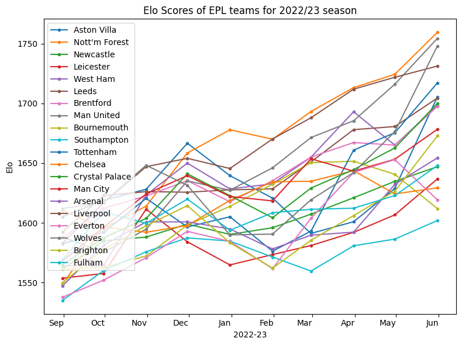

# Elo Data Analysis

This repository contains a data analysis of the English Premier League (EPL) season 2022-23 using the Elo ranking system. The Elo ranking system is a widely used method for calculating the relative skill levels of players or teams in a two-player or two-team competition.

I was inspired to learn more about the Elo system after watching the movie "The Social Network," where Mark Zuckerberg asks for the algorithm to create Facemash.com. 

## What is Elo ranking system?

The Elo ranking system is implemented in the `elo.py` file, which includes a Python class named Elo. The class provides methods for calculating Elo scores for two teams based on the match result. The default base Elo score is set to 1500, and the K-factor is set to 32, which can be adjusted as needed.

    

## Data Analysis

The data analysis is performed using Python and Jupyter Notebook. The code is provided in the notebook.ipynb file, and it covers the following key aspects:

* Data Loading and Initial Exploration
* Data Preprocessing
* Visualizations
* Visualization of match results (Wins, Draws, Losses)
* Top 5 teams with the most wins
* Win percentage at home and away games
* Calculation and update of Elo scores for each team
* Top 5 teams with the highest Elo scores
* Comparison of wins and Elo scores for each team
* Trend of Elo scores for each team grouped by month

## Usage

To use this code and perform the analysis on your own dataset, follow these steps:

* Download the repository to your local machine.
* Run this command `pip install pandas matplotlib numpy seaborn` 
* Run the notebook.ipynb file using Jupyter Notebook. 

You can also customize the code to load your own dataset.

## Acknowledgements

* [The Elo System](https://quantdare.com/elo-system/)
* [The Social Network (2010)](https://www.imdb.com/title/tt1285016/)
* [Football-Data.co.uk](https://www.football-data.co.uk/)